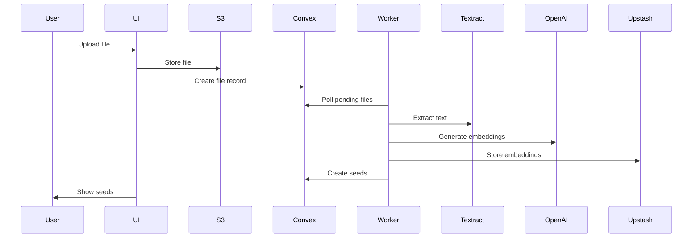
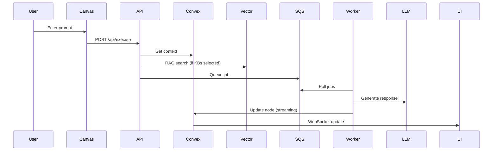

# DISI AI - Intelligent Canvas & Knowledge Garden

Un sistema de generación de AI con canvas interactivo y gestión de conocimiento basada en RAG (Retrieval-Augmented Generation).

---

## 🔥 New to this project?

**👉 [START HERE - Quick Setup Guide](START_HERE.md)**

---

## 🚀 Quick Start

### 1. Install Dependencies

```bash
npm install
```

### 2. Configure Environment

Create `.env.local` with:

```bash
# Required
FILE_WORKER_SECRET="your-secret-here"
OPENAI_API_KEY="sk-proj-..."
NEXT_PUBLIC_CONVEX_URL="https://your-project.convex.cloud"

# Optional (for AWS services)
AWS_REGION="us-east-1"
AWS_ACCESS_KEY_ID="AKIA..."
AWS_SECRET_ACCESS_KEY="..."
```

### 3. Start All Services ⭐ CRÍTICO

**IMPORTANTE:** Debes ejecutar **3 servicios** para que Knowledge Garden funcione:

**Opción A: Todo de una vez (Recomendado)**

```bash
npm run dev:all
```

Esto inicia:
- ✅ Next.js (puerto 3000)
- ✅ AI Worker
- ✅ File Worker ⭐ (procesa uploads de KG)

**Opción B: Windows Script**
```bash
.\start-workers.bat
```

**Opción C: Linux/Mac Script**
```bash
chmod +x start-workers.sh
./start-workers.sh
```

**Opción D: Manual (3 terminales)**
```bash
# Terminal 1
npm run dev

# Terminal 2 (CRÍTICO para KG)
npm run file-worker

# Terminal 3
npm run worker
```

Open [http://localhost:3000](http://localhost:3000)

**Ver:** [HOW_TO_START.md](HOW_TO_START.md) para guía detallada

---

## ⚠️ IMPORTANT: Workers Must Be Running

Para que el **Knowledge Garden** funcione, los workers DEBEN estar corriendo:

- ✅ `file-worker` - Procesa uploads y crea seeds
- ✅ `ai-worker` - Procesa requests de canvas
- ✅ `next dev` - Servidor web

Si no corren los workers, los archivos se quedarán en "Processing..." forever.

Ver [QUICKSTART.md](QUICKSTART.md) para troubleshooting.

---

## 🏗️ Architecture

### Tech Stack

- **Frontend**: Next.js 14 (App Router) + React 19 + ReactFlow
- **Backend**: Convex (Database + Functions)
- **AI**: OpenAI (GPT-4, Embeddings), Anthropic (Claude), Google (Gemini)
- **Storage**: AWS S3, Upstash Redis, Upstash Vector
- **Processing**: AWS Textract, AWS Transcribe
- **Auth**: Clerk

### Key Features

#### 1. **Canvas Interactivo**
- Nodes: Input, Response, Display, File
- Real-time AI streaming
- Branching conversations
- File attachments

#### 2. **Knowledge Garden** 🆕
- Upload files (PDF, images, audio, text)
- Automatic text extraction (Textract, Transcribe)
- Smart chunking & embeddings
- Vector search (Upstash Vector)
- Graph linking (seed relationships)

#### 3. **RAG (Retrieval-Augmented Generation)**
- Select Knowledge Bases from sidebar
- Automatic context retrieval
- Citations in responses

---

## 📊 Project Structure

```
disi-ai/
├── app/                      # Next.js App Router
│   ├── _components/          # React components
│   │   ├── canvas/           # Canvas UI
│   │   ├── kb/               # Knowledge Garden UI
│   │   └── chat/             # Chat components
│   └── api/                  # API routes
│       ├── execute/          # Canvas execution
│       ├── ai/request/       # AI requests
│       └── file/             # File handling
├── convex/                   # Convex backend
│   ├── canvas/               # Canvas functions
│   ├── knowledge_garden/     # KG functions
│   ├── system/               # System functions
│   └── users/                # User management
├── workers/                  # Background workers
│   ├── file-worker.ts        # File processing
│   ├── ai-worker.ts          # AI streaming
│   └── ingest-worker.ts      # (stub)
├── lib/                      # Utilities
│   ├── aws/                  # AWS integrations
│   ├── upstash/              # Upstash clients
│   └── aiServices/           # AI providers
└── components/               # Shared components
```

---

## 📚 Documentation

- **[QUICKSTART.md](QUICKSTART.md)** - Inicio rápido y troubleshooting
- **[WORKER_SETUP.md](WORKER_SETUP.md)** - Configuración de workers
- **[ARCHITECTURE_DIAGRAMS.md](ARCHITECTURE_DIAGRAMS.md)** - Diagramas de arquitectura
- **[KNOWLEDGE_GARDEN_ARCHITECTURE.md](KNOWLEDGE_GARDEN_ARCHITECTURE.md)** - Arquitectura del KG
- **[KNOWLEDGE_GARDEN_FIXES.md](KNOWLEDGE_GARDEN_FIXES.md)** - Changelog de bugs corregidos

---

## 🔧 Development

### Running Services Separately

Terminal 1 (Next.js):
```bash
npm run dev
```

Terminal 2 (AI Worker):
```bash
npm run worker
```

Terminal 3 (File Worker):
```bash
npm run file-worker
```

### Convex

Deploy schema changes:
```bash
npx convex dev
```

### Testing

```bash
# Run tests
npm test

# Watch mode
npm test -- --watch
```

---

## 🎯 How It Works

### Knowledge Garden Flow



### Canvas Execution Flow



---

## 🐛 Troubleshooting

### File Stuck in "Processing"

**Causa**: Worker no está corriendo

**Solución**:
```bash
# Kill all workers
taskkill /F /IM node.exe    # Windows
pkill -f "node|tsx"         # Linux/Mac

# Restart
npm run dev:all
```

### Cannot Connect to Convex

**Solución**:
```bash
# Verify URL
cat .env.local | grep CONVEX_URL

# Start Convex dev
npx convex dev
```

### RAG Not Working

**Verificar**:
1. File-worker está corriendo ✅
2. Seeds aparecen en sidebar después de upload ✅
3. KB está seleccionada en canvas chat ✅
4. Logs muestran "Searching Knowledge Bases" ✅

---

## 📈 Performance

- **File Processing**: < 30s para archivos < 10MB
- **Seed Creation**: ~1 seed per 1000 tokens
- **Duplicate Detection**: Similarity threshold > 0.95
- **RAG Latency**: < 2s (embed + search + LLM)

---

## 🔐 Security

- **Authentication**: Clerk
- **Authorization**: Convex functions verifican ownership
- **API Keys**: Stored in AWS Secrets Manager (opcional) o Convex environment
- **File Access**: Presigned S3 URLs
- **Worker Auth**: Shared secret (FILE_WORKER_SECRET)

---

## 🚢 Deployment

### Frontend (Next.js)

Deploy to Vercel:
```bash
vercel
```

### Backend (Convex)

```bash
npx convex deploy
```

### Workers

Deploy as separate services:
- Heroku Worker Dyno
- AWS ECS Task
- Railway Background Worker
- Render Background Worker

---

## 📝 License

MIT

---

## 🤝 Contributing

1. Fork the repository
2. Create feature branch (`git checkout -b feature/amazing-feature`)
3. Commit changes (`git commit -m 'Add amazing feature'`)
4. Push to branch (`git push origin feature/amazing-feature`)
5. Open Pull Request

---

## 💬 Support

- Issues: [GitHub Issues](https://github.com/yourusername/disi-ai/issues)
- Docs: Ver carpeta de documentación

---

**Built with ❤️ using Next.js, Convex, and OpenAI**
